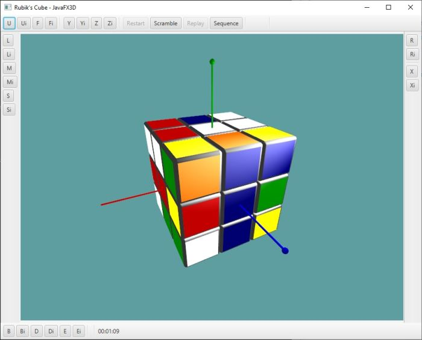

# RubikFX

A JavaFX-based desktop application for playing with a 3D model of the Rubik's Cube by rotating 
layers or the whole cube (as originally described [upstream](https://github.com/jperedadnr/RubikFX)
by José Pereda.)

For a version that can build a native image for desktop, Android and/or iOS platforms,
see [rubiks-cube](https://github.com/gluonhq/gluon-samples/tree/master/rubiks-cube).

---

This fork adds the Gradle and Maven wrappers and build scripts to compile and package
this desktop application.

The Gradle or Maven build script produces a `RubikFX` application, for running in standard JVM/JavaFX 11+.
The build scripts can also produce stand-alone native executables, using
[GraalVM native-image](https://www.graalvm.org/reference-manual/native-image/) utility,
for common platforms (Windows, and Linux.)

## Gradle build tasks

### Building for standard JVM environment

To build and run the `RubikFX` application in standard JVM environment, execute the Gradle `run` task:

	gradlew run

To create an executable uber jar which includes all dependencies for all supported OS'es:

	gradlew uberJar

and the resulting `RubikFX-1.0.0-SNAPSHOT-no-deps.jar` file should be created in `build/libs` directory,
and can be executed directly with the `java` command:

	java -jar build/libs/RubikFX-1.0.0-SNAPSHOT-no-deps.jar

(or if building on a Windows machine:

	java -jar build\libs\RubikFX-1.0.0-SNAPSHOT-no-deps.jar

)

This `RubikFX-1.0.0-SNAPSHOT-no-deps.jar` file should be portable across all
three supported OS'es (Windows, Mac and Linux.)

### Building native executable

RubikFX can be compiled to a stand-alone native executable, e.g. producing `RubikFX.exe` in Windows,
using the [GraalVM native-image](https://www.graalvm.org/reference-manual/native-image) utility.
The link shows how to set up GraalVM and its native-image utility for common platforms.
[Gluon](https://gluonhq.com/) also provides some setup [details](https://docs.gluonhq.com/#_platforms)
for GraalVM native image creation.

The Gradle build script uses [gluonfx-gradle-plugin](https://github.com/gluonhq/gluonfx-gradle-plugin)
from Gluon to build the native executable from Gradle with GraalVM.
GraalVM native-image utility will use the configuration files in
`src/graal-cfg/<currentPlatform>/META-INF/native-image` folder
to assist in native-image generation.

Once the GraalVM prerequisites are set up for the current platform,
run the `nativeBuild` task to produce a native executable:

	gradlew nativeBuild

The `nativeBuild` task will take a while to finish, resulting in a native executable file at:

	build/gluonfx/x86_64-linux/RubikFX

(or if building on a Windows machine:

	build\gluonfx\x86_64-windows\RubikFX.exe

)

## Maven build tasks

### Building for standard JVM environment

To build and run the `RubikFX` application in standard JVM environment, execute the Maven `javafx:run` task:

	mvnw javafx:run

To create an executable uber jar which includes all dependencies for the current platform:

	mvnw package

and the resulting `rubikfx-1.0.0-SNAPSHOT-no-deps-<platform>.jar` file should be created in
`target` directory, and can be executed directly with the `java` command:

	java -jar target/rubikfx-1.0.0-SNAPSHOT-no-deps-linux.jar

(or if building on a Windows machine:

	java -jar target\rubikfx-1.0.0-SNAPSHOT-no-deps-win.jar

)

### Building native executable

RubikFX can be compiled to a stand-alone native executable, e.g. producing `RubikFX.exe` in Windows,
using the [GraalVM native-image](https://www.graalvm.org/reference-manual/native-image) utility.
The link shows how to set up GraalVM and its native-image utility for common platforms.
[Gluon](https://gluonhq.com/) also provides some setup [details](https://docs.gluonhq.com/#_platforms)
for GraalVM native image creation.

The Maven build script uses [gluonfx-maven-plugin](https://github.com/gluonhq/gluonfx-maven-plugin)
from Gluon to build the native executable from Maven with GraalVM.
GraalVM native-image utility will use the configuration files in
`src/graal-cfg/<currentPlatform>/META-INF/native-image` folder
to assist in native-image generation.

Once the GraalVM prerequisites are set up for the current platform,
run the `gluonfx:build` task to produce a native executable:

	mvnw gluonfx:build

The `gluonfx:build` task will take a while to finish, resulting in a native executable file at:

	target/gluonfx/x86_64-linux/RubikFX

(or if building on a Windows machine:

	target\gluonfx\x86_64-windows\RubikFX.exe

)

## IDE support

The project can be imported as-is to any IDE such as Eclipse, IntelliJ IDEA, etc, which understands
a Gradle and/or Maven project structure.

